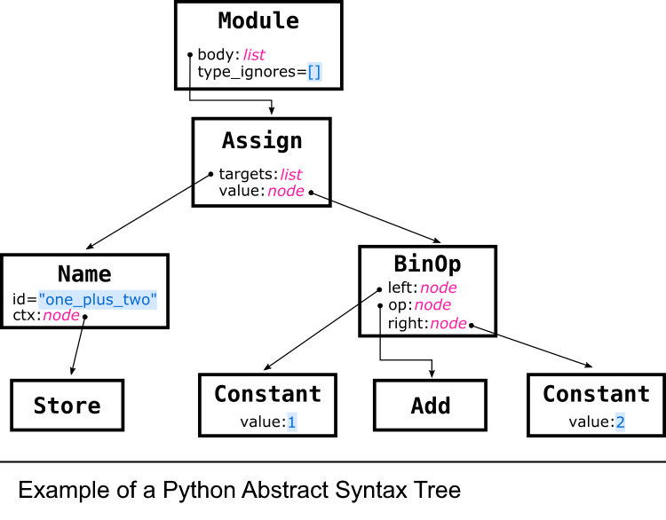

# What is Bandit?
Bandit is a security focused static analysis tool for identifying common vulnerabilities in Python projects. It achieves this by scanning Python source code files for security flaws that could be exploited if deployed in production. These flaws can be, for example, hardcoded secrets that can lead to unauthorized access (passwords, API keys, etc.), use of unsecure functions, risk of injection attacks, usage of weak cryptographic algorthims, etc.

The security scanning is performed through a scan of the abstract syntax tree of the Python code, matching it against a set of predefined rules. Bandit also comes with a set of built-in tests for common vulnerabilities, and lets users write their own custom tests relevant to their own specific projects.

# Relevance in a DevOps perspecitve
- Automated code review: Bandit allows for a kind of automated security code review, which speeds up the development process without sacrificing security. This type of automated testing and review is very relevant in DevOps.
- Automation and integration: Bandit can be easily integrated into CI/CD pipelines, using GitHub Actions or other tools. This allows Bandit to work in harmony with other tools and processes that are part of the DevOps structure and environment.
- Consistency: Bandit ensures a consistent level of security by applying the same rules and standards to all Python projects and source files. This helps enforce best practices and maintaing a good level of security across projects.
