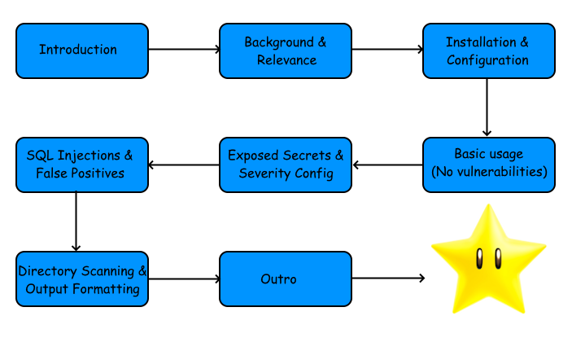

 

Hi and welcome to our introduction to the Bandit security linting tool in Python! This is an executable tutorial written using Killercoda, that introduces various features with the Bandit tool. It also includes a background explaining the relevance of Bandit in a DevOps context.

# Intended learning outcomes
- **Understand Bandit**: Learners will be able to explain what Bandit is, why it is used, and its role in identifying security vulnerabilities in Python code.
- **Install and run Bandit**: Learners will be able to install and set up Bandit, and run it against Python code.
- **Configure Bandit**: Learnerns will be able to cofigure Bandit to their needs, using different features and options provided by the tool.
- **Identify and resolve common security issues**: Learners will be able to recognize and identifiy common Python vulnerabilities that are detectable by Bandit, such as secret exposure and possible SQL injection vectors.

# Overview
1. Introduction
2. Background and Relevance
3. Installation and Configuration
4. Basic Usage: No Vulnerabilities
5. Secrets and Severity
6. False Positives
7. Directory Scanning and Output Formatting
8. Outro

